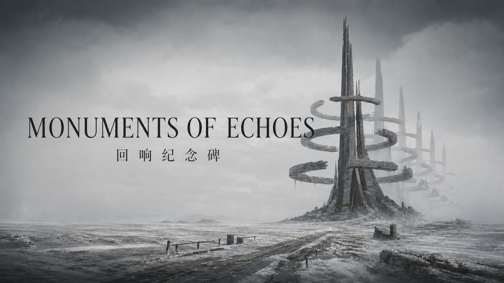

# MONUMENTS OF ECHOES

## 回响纪念碑

> 一座在人类文明消亡后仍然运行的个人档案遗迹。  
> 世界已经失联，记录仍在继续。



`MONUMENTS OF ECHOES / 回响纪念碑`是一个互动叙事型个人网站MVP。访问者不是在浏览传统个人主页，而是在一套严重老化的未来档案系统中，逐步恢复一个人留下的通信、思想、记忆、创造、身份与情感痕迹。

项目将电影式场景、个人作品集和子站导航整合为同一套世界观，同时保留从首屏直接打开档案索引的快速通道。

## 核心体验

- **双入口首屏**：选择约90秒的沉浸叙事，或直接打开公共档案索引。
- **六章恢复主线**：启动、荒原、中继站、中央遗迹、遗物锻造场与身份观测塔。
- **混合轴探索**：主线保持纵向推进，中央遗迹可向左进入记忆库、向右进入迁徙思想。
- **原创视觉语言**：以“一轴、三响、六缺环”统一标志、场景、动效和状态。
- **身份纠错结尾**：系统最终发现自己读取的不是静止遗物，而是一份仍在更新的记录。
- **轻量2.5D实现**：电影感场景使用原创位图、CSS景深、雾层、粒子与程序化图形完成，无运行时3D引擎。
- **完整功能通道**：作品、身份和所有公开模块在两次操作内可达。
- **设备本地记忆**：保存声音、动态偏好、访问记录和上次章节。
- **响应式与无障碍**：支持移动端、键盘导航、减少动态、语义化内容与屏幕阅读器状态播报。

## 叙事结构

```text
ENTRY
├─ ARCHIVE INDEX
└─ BOOT
   ↓
WASTELAND
   ↓
COMMUNICATION RELAY
   ↓
MEMORY ← ARCHIVE NEXUS → IDEA / THOUGHT
   ↓
ARTIFACT FORGE
   ↓
IDENTITY RECOVERY
   ↓
SOURCE SIGNAL: ACTIVE
```

主线没有自动播放或强制倒计时。90秒只是连续推进时的典型节奏，用户可以随时暂停、返回、跳过或进入档案索引。抵达中央遗迹后，桌面端将鼠标移至画面左缘或右缘并短暂停留即可进入分支；左右方向键、横向触控板与Shift+滚轮仍可使用，`Esc`返回中枢。

## 档案模块

| 模块 | 世界观节点 | 内容定位 | MVP状态 |
|---|---|---|---|
| Mail | 通讯中继站 | 通信、来信与连接痕迹 | 已实现主站节点 |
| Idea | 迁徙思想 | 随想、灵感与未完成计划 | 已实现全屏分支场景 |
| Memory | 人类记忆库 | 影像、经历与人生片段 | 已实现全屏分支场景 |
| Works | 遗物锻造场 | 网站、软件、AI与设计项目 | 已实现作品入口 |
| About | 身份恢复程序 | 个人介绍、技能与外部链路 | 已实现身份结尾 |
| Love | 封存庭园 | 私密的双生记忆 | 仅保留封存伏笔 |

Love模块在当前MVP中不包含私人内容或前端密码。正式接入时应使用服务端认证，并同时保护页面、缩略图和原始媒体资源。

## 技术架构

```text
Semantic Document Layer
├─ 标题、章节与档案内容
├─ 标准按钮、导航与焦点顺序
└─ SEO、无障碍与静态回退

Cinematic Visual Layer
├─ 固定场景舞台
├─ 原创荒原、中央遗迹与观测塔场景
├─ 回响环、扫描、雾、粒子与机械装置
└─ 根据当前章节渐进切换

Client State
├─ 当前章节
├─ 思想／记忆全屏分支与URL状态
├─ 通讯恢复状态
└─ localStorage设备偏好
```

技术栈：

- React 19
- TypeScript
- Vinext / Vite
- CSS动画与响应式布局
- Cloudflare Worker兼容构建

完整设计说明参见[ARCHITECTURE.md](ARCHITECTURE.md)，执行拆分参见[PLAN.md](PLAN.md)。

## 快速开始

### 环境要求

- Node.js 22.13或更高版本
- npm

### 安装与运行

```bash
npm ci
npm run dev
```

开发服务器默认运行在：

```text
http://localhost:3000/
```

### 生产构建

```bash
npm run build
```

### 检查

```bash
npm run lint
npm test
```

## 项目结构

```text
myweb/
├─ app/
│  ├─ ArchiveExperience.tsx  # 章节、交互、偏好与档案索引
│  ├─ archive-data.ts        # 叙事文案、模块与作品配置
│  ├─ globals.css            # 视觉系统、动效与响应式布局
│  ├─ layout.tsx             # 页面元数据与社交分享配置
│  └─ page.tsx               # 页面入口
├─ public/
│  ├─ images/
│  │  ├─ wasteland-monument.png
│  │  ├─ archive-hub.png
│  │  ├─ identity-observatory.png
│  │  ├─ memory-reservoir.png
│  │  └─ migrating-thoughts.png
│  └─ og.png
├─ tests/
│  └─ rendered-html.test.mjs
├─ ARCHITECTURE.md
├─ PLAN.md
└─ README.md
```

## 内容定制

主要内容集中在`app/archive-data.ts`：

- `chapters`：主线章节、系统状态、标题与正文。
- `nexusBranches`：中央遗迹左右分支的场景、文案与档案记录。
- `archiveNodes`：六个档案模块、状态和目标章节。
- `artifactRecords`：作品卡片。

接入真实个人信息时，建议依次替换：

1. `artifactRecords`中的示例作品；
2. 身份恢复章节中的角色描述；
3. Mail、Idea、Memory、Works与About的真实URL；
4. 头像、GitHub和联系方式；
5. 子站返回主站时的章节恢复参数。

## 设计原则

1. 艺术体验是选择，不是访问内容前必须通过的门槛。
2. 外层可以像遗物，内层必须像专业作品集。
3. 远景负责尺度，近景负责交互，声音与镜头负责连接。
4. 功能文字不使用低对比度、随机故障或不可读的小字号。
5. 移动端主线保持纵向叙事；中央节点使用局部左右滑动，方向文字只承担空间提示，不呈现按钮卡片。
6. Canvas或3D只能渐进增强，不能承载唯一的信息和导航。
7. 世界毁灭原因保持未知，最终主题始终是“一个人如何被留下”。

## 当前边界

这是主站MVP，目前尚未包含：

- 真实子域名内容；
- 实时3D与WebGL场景；
- 完整鸟群、水体和机械动画；
- Love模块的认证与媒体存储；
- 真实个人作品、头像和联系信息。

这些能力应在主线体验、内容结构和性能预算稳定后逐步接入。

## 项目状态

当前版本已经通过：

- 生产构建；
- ESLint检查；
- 服务端渲染测试；
- 公共档案完整性测试；
- 桌面与手机端实机布局检查；
- 左右分支、键盘返回与深链接检查；
- 本地HTTP可用性检查。

项目当前为私人开发项目，未经授权不得公开分发其中的场景资产与私人内容。
